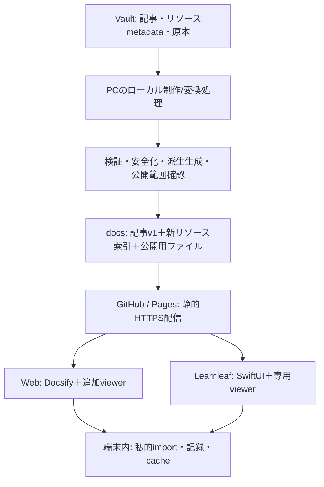

# 4. システム基本設計書
状態: 提案。現行アーキテクチャは[ARCHITECTURE](../../ARCHITECTURE.md)、拡張データは[05](05-data-design.md)。

## 推奨構成

現行配信にDB/API serverはない。変換をPagesのrequest処理には置かない。ローカル制作ツールは同じrepositoryの補助工程として設計し、別のユーザー向けアプリへ分離しない。初期は既存Node工程から外部converterを呼ぶ案とし、採用環境は未確定。

## 責務分割

| 拡張コンポーネント案 | 入力→出力/責務 | 再利用 |
| --- | --- | --- |
| ResourceImporter | File/Files→検証された私的原本・metadata、publicへ自動送信しない | 音声importの検証→確定モデル |
| LocalConverter | 原本hash+profile→PDF/抽出text/thumb/安全化SVG | Nodeの既存生成工程に接続 |
| ResourcePublisher | 明示公開metadata→公開派生・索引、atomicなrelease staging | 同期manifestの上書き・削除保護 |
| ResourceResolver | resourceID+role→許可されたpath/hash | ArticleLinks/ArticleClientの境界設計 |
| ViewerRouter | MIME/role→SVG/PDF/slide/text viewer | Web shell、iOS NavigationStack |
| RelationResolver | articleID/resourceID/elementID→相互参照 | 記事IDとタグ関連 |
| PresentationBuilder | 記事AST+選択範囲→slide草稿、差分候補 | 既存Markdown記事とmetadata |
| LocalResourceStore | hash検証cache・私的原本・quota・export | iOS OfflineArticlesのactor設計 |

これらは責務名であり、今回ファイル/クラスは実装しない。

## 配信互換性と公開時の一貫性

app-articles.v1.jsonとそのhash規則は維持。resources.v1.jsonとrelations.v1.jsonを追加する提案。記事一覧との関連はarticleCatalogRevisionで結ぶ。旧iOSは新索引を取得せず従来どおり動く。新viewerは対応roleだけ表示し、未対応なら原本情報/代替PDFへ案内。

immutableなhash pathへ派生を配置し、ファイル生成・検証後に索引を最後に切り替える。Pages/CDNで索引とファイルの版が一時的に異なる場合、限定再取得と「更新中」を表示し、hash検証を省略しない。旧公開索引のcache期間が終わるまで参照ファイルを保持する。

## WebとiOSの実装境界案

WebはDocsify hookへ安全な画像/図解リンクを追加し、専用viewerを遅延読み込み。本文全体を新フレームワークへ移行しない。PDF.js、Reveal.jsは制限されたviewer領域で扱う。

iOSはMarkdownUIを維持し、PDFKitを第一候補、SVGは安全化SVGの限定WKWebViewかPNG派生+拡縮を比較。WKWebViewを導入するならADR-010/ios READMEの従来「任意JavaScriptなし」を守るため、原本script禁止とviewer自身の制御scriptを区別する新ADRが必要。Reveal表示も限定WebView案とPDF代替案の実機比較後に決める。

## 将来AI・クラウド

AI jobはinputID/hash・task種別・policy・生成候補・model/版・根拠・承認状態を持つ。確定前に原本へ反映せず、更新競合を検知して再確認する。RAGはresource/page/slide/element単位の根拠へ戻れる。機密判定と明示許可なしに外部AIへ送信しない。

将来のクラウドはResolver/Importerの保存providerを追加できるようにする。認証・削除競合・機密資料配信は別設計であり、一般公開Pagesを非公開ストレージとして扱わない。
